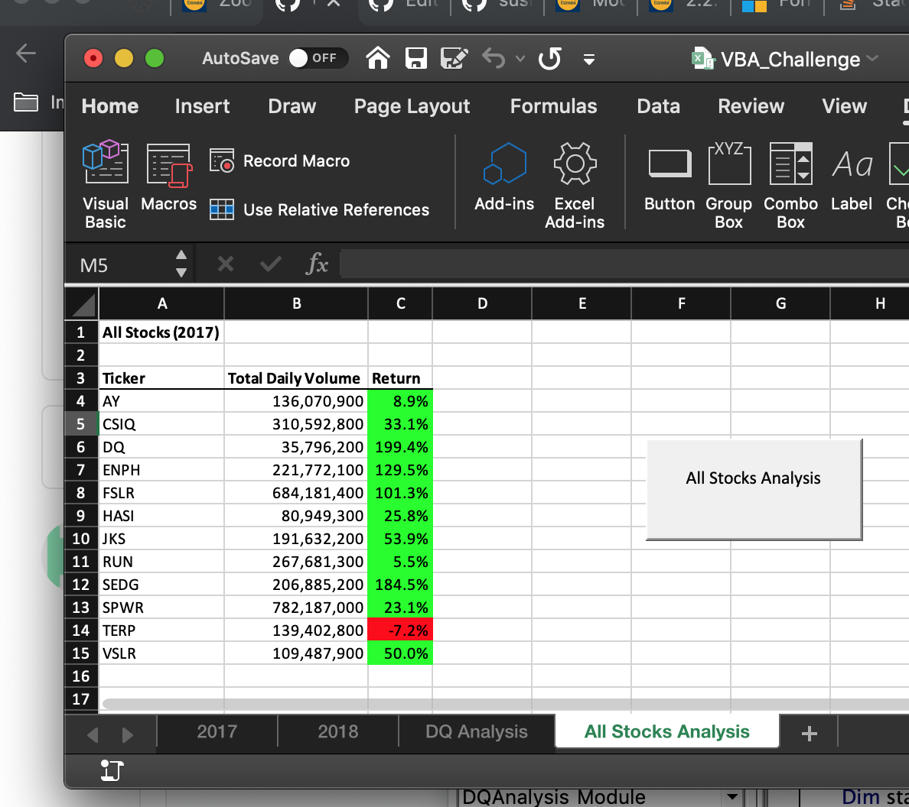
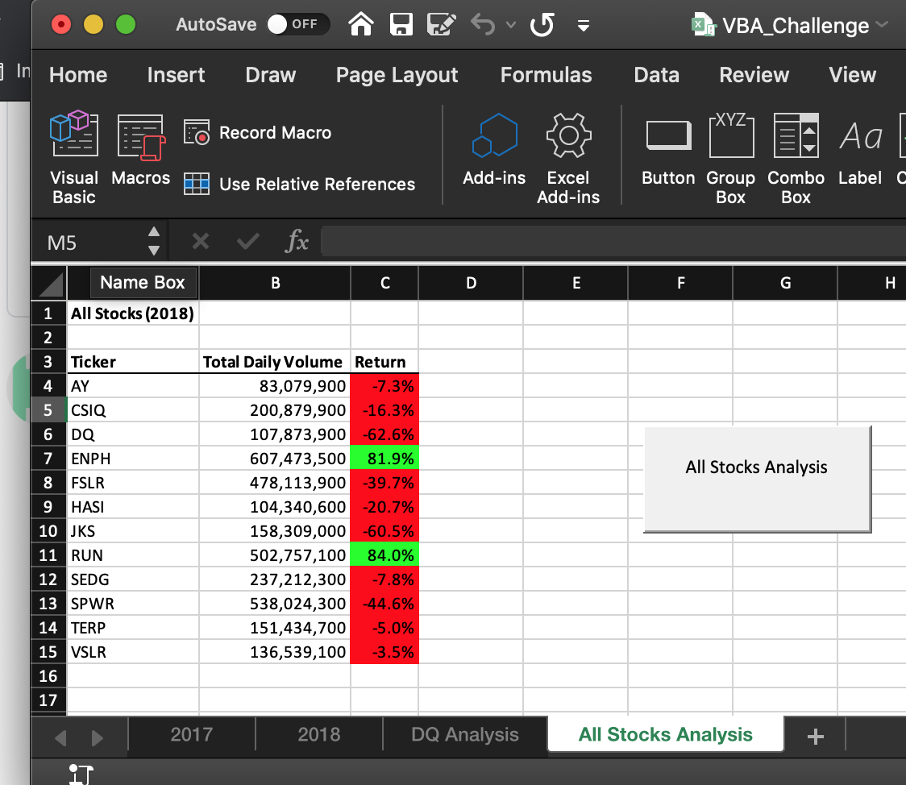

# Stocks-analysis

## Challenge-bold

### The biggest challenge I had was I found myself forgetting too save as macro enabled sheets so my button wasn't working at first, until I saved as .xlsm

## Porject Background
### The purpose of our Stock Analysis challenge was to help Steve easily compare *Total Daily Volume* and *Yearly Return* for the years *2017* and *2018*. By creating a VBA for 2017 and 2018, Steve can easily compare stocks and industries. One advantage of using Macros is it reduces the chance for more human error and relies on your Macro instead to be more efficient.

## Results

### In 2017, we see a positive return in too almost all stocks except for TERP, with a -7.2% 

### In 2018, we see a positive return to only two stocks which were ENPH, with a +81.9% return, and RUN, with a 84% return.

## Summary
## What are the advantages or disadvantages of refactoring code?
### One advantage is too keep the code running smoothly and one disadvantage is if your code is longer it may take extra time to refactor
## How do these pros and cons apply to refactoring the original VBA script?
### A few pros for refactoring original VBA script is *code smell* detection in most cases and having a chance for someone to look over your work is always a good thing to check for errors. In some cases refactoring the orginal VBA may take longer than just rewriting the whole script from scratch.
